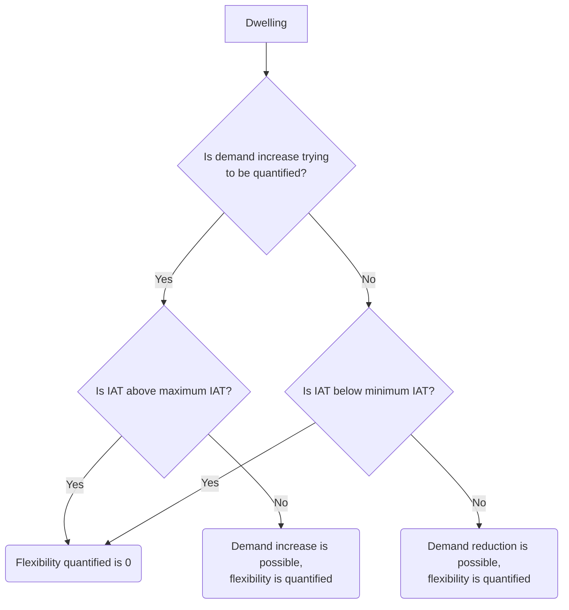

```mermaid
flowchart
    dwelling[Dwelling] --> typeRequest{Is demand increase trying<br/>to be quantified?}
 
    
    typeRequest--> |Yes| increaseAboveIAT{Is IAT above maximum IAT?}
    increaseAboveIAT-->|Yes| noChange(Flexibility quantified is 0)

    increaseAboveIAT-->|No| increaseDemand(Demand increase is possible,<br/>flexibility is quantified)

    typeRequest--> |No| reductionBelowIAT{Is IAT below minimum IAT?}
    reductionBelowIAT-->|Yes| noChange
    reductionBelowIAT-->|No| reduceDemand(Demand reduction is possible,<br/>flexibility is quantified)

```
